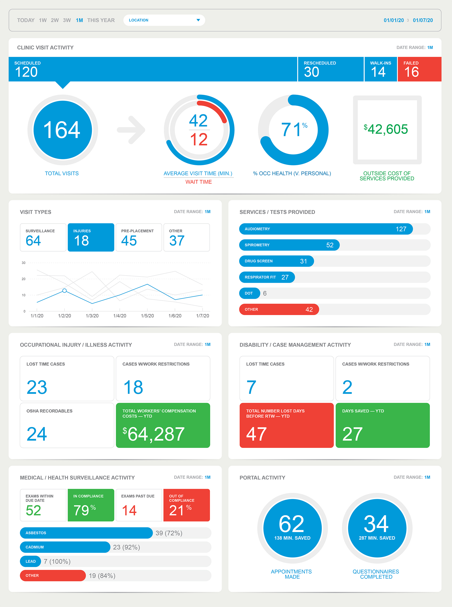

# upwork-ui-dashboard

## Project Goal
Create a fully functioning, responsive, Bootstrap 4 dashboard based on the above SVG design. The dashboard should look good at all screen sizes, optimized for mobile viewing, and printing. The dashboard should nicely fit on two pieces of printed paper. 

The source of the data should pull from a JSON object of the data, and populate the HTML sections. Each section should work on its own without any other section.

When the date filter changes at the top, all of the data in all sections should animate/change to the new values. The location dropdown should be a select 2 dropdown.

https://c3js.org/ or https://www.chartjs.org/ should be used for the graphs unless there is a better library you recommend. Please let us know!

We would like the final result to be as close to "pixel-perfect" from the original design spec, but we understand there will be slight variances. We hope the end result looks as good or better than the mockup dashboard design.

## Coding Standards
The code should be clean, simple, and formatted nicely. Utilize HTML, CSS (you can use SCSS and precompile to CSS if you want to set that up), etc. Do not copy any pre-existing themes or templates to complete this job. We're not looking for a pre-made, copy-pasted bootstrap dashboard!

Please fork and submit your code as a pull request to https://github.com/wreiske/upwork-ui-dashboard

Commit your code along the way as your work to your fork.

## Resources
Please keep the included resources to a minimum. You can use cdnjs to include third-party resources such as bootstrap, jquery, select2, etc.

https://cdnjs.com/libraries/twitter-bootstrap

https://cdnjs.com/libraries/select2

https://cdnjs.com/libraries/jquery

https://cdnjs.com/libraries/Chart.js

https://cdnjs.com/libraries/c3
